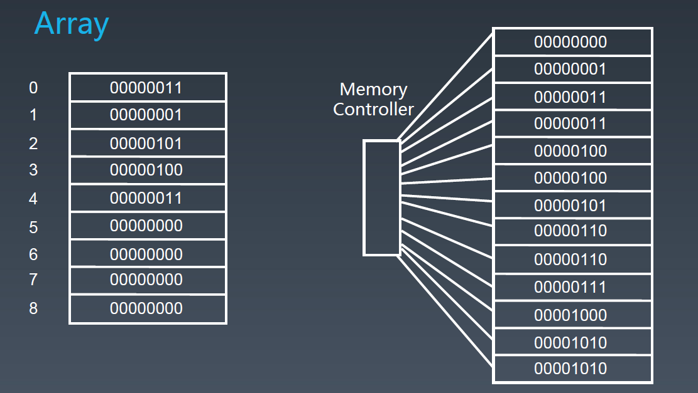
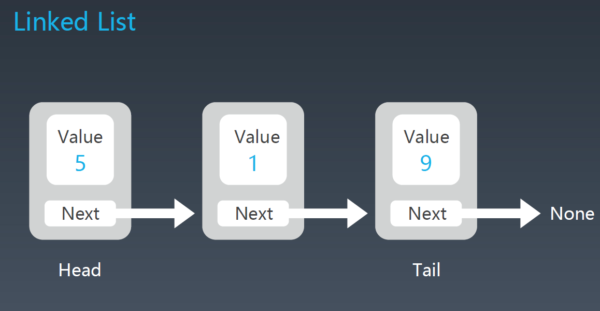
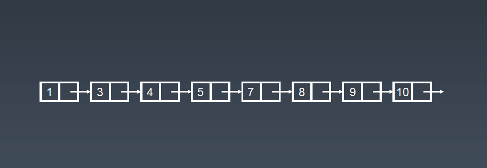

# 数组

每次创建数组，计算机实际上是在内存中开辟了一段`连续`的地址，每个地址可通过内存管理器进行访问。



## 优点

- 随机访问某个地址的时间复杂度：`O(1)`

## 缺点

- 插入 / 删除元素的时间复杂度为 `O(n)`

 - 每次向数组插入元素，需要依次挪动所插入元素的后续元素，故该操作的时间复杂度不再是常数级

 - 最坏情况下，需要挪动整个数组，如：插入首个元素

 - 最好情况下，插入的时间复杂度为 `O(1)`，即插入元素为最末元素

 - 删除元素同理

## 时间复杂度

!> 注意：正常情况下数组的 prepend 操作的时间复杂度是 `O(n)`，但是可以进行特殊优化到 `O(1)`。采用的方式是申请稍大一些的内存空间，然后在数组最开始预留一部分空间，然后 prepend 的操作则是把头下标前移一个位置即可。

- prepend：`O(1)`

- append：`O(1)`

- lookup：`O(1)`

- insert：`O(n)`

- delete：`O(n)`

# 链表

在频繁需要进行增删操作时，`数组` 这种数据结构并不好用，此时可以考虑 `链表`。

`链表` 的每个元素一般用一个 `class` 来定义，存放 `value` 及指向下个元素的 `next` 指针，如果再增加一个 `prev` 指针指向上一个元素，则称为 `双向链表`。



- Head：代表 `头指针`

- Tail：代表 `尾指针`，最后一个元素的 `next` 指针指向 `null`

!> 当 `单向链表` 的 `尾指针` 指向 `头指针` 时，称为 `循环链表`。

## 优点

- 插入 / 删除元素的时间复杂度：`O(1)`

## 缺点

- 当访问首尾节点的时间复杂度为 `O(1)`

- 当访问任意节点时，需要从头开始进行线性查找，时间复杂度为 `O(n)`

## 时间复杂度（普通链表）

- prepend：`O(1)`

- append：`O(1)`

- lookup：`O(n)`

- insert：`O(1)`

- delete：`O(1)`

## 实际应用

- [LRU Cache](https://www.jianshu.com/p/b1ab4a170c3c)

- [leetcode第146题：LRU缓存机制](https://leetcode-cn.com/problems/lru-cache/)
## 简单实现

``` javascript
// 节点
class Node{
  constructor(data){
    this.data = data
    this.next = null
  }
}
// 单向链表
class LinkList{
  constructor(){
    // 总长度
    this.length = 0
    // 首元素
    this.head = null
  }

  // 新增
  append(data){
    let node = new Node(data)
    let cur
    if(this.head){
      // 遍历链表
      cur =  this.head
      // 寻找未绑节点
      while(cur.next) {
        cur = cur.next
      }
      // 绑定新增节点
      cur.next = node
    }else{
      this.head = node
    }
    this.length++
  }
  
  // 打印
  print(){
    let cur = this.head
    let res = []
    while(cur){
      res.push(cur.data)
      cur = cur.next
    }
    console.log(res.join(' => '))
  }

  // 删除指定索引的元素
  removeAt(index){
    if(index < 0 || index > this.length - 1){
      console.log('index: out of range!')
      return
    }
    let cur = this.head
    let prev
    let i = 0
    if(index === 0){
      this.head = cur.next
    }else{
      while(i < index){
        // 保存当前节点到 prev
        prev = cur
        // 将下一个节点指向当前节点 cur
        cur = cur.next
        i++
      }
      prev.next = cur.next
      cur.next = null
    }
    this.length --
    return cur.data
  }
}

// 测试
let linkList = new LinkList()
linkList.append('你好')
linkList.append('我是')
linkList.append('一名')
linkList.append('前端工程师')
linkList.print()
console.log(linkList.length)
console.log(linkList.removeAt(3))
linkList.print()
console.log(linkList.length)

```

# 链表

在频繁需要进行增删操作时，`数组` 这种数据结构并不好用，此时可以考虑 `链表`。

`链表` 的每个元素一般用一个 `class` 来定义，存放 `value` 及指向下个元素的 `next` 指针，如果再增加一个 `prev` 指针指向上一个元素，则称为 `双向链表`。


- Head：代表 `头指针`

- Tail：代表 `尾指针`，最后一个元素的 `next` 指针指向 `null`

!> 当 `单向链表` 的 `尾指针` 指向 `头指针` 时，称为 `循环链表`。

## 优点

- 插入 / 删除元素的时间复杂度：`O(1)`

## 缺点

- 当访问首尾节点的时间复杂度为 `O(1)`

- 当访问任意节点时，需要从头开始进行线性查找，时间复杂度为 `O(n)`

## 时间复杂度（普通链表）

- prepend：`O(1)`

- append：`O(1)`

- lookup：`O(n)`

- insert：`O(1)`

- delete：`O(1)`

## 实际应用

- [LRU Cache](https://www.jianshu.com/p/b1ab4a170c3c)

- [leetcode第146题：LRU缓存机制](https://leetcode-cn.com/problems/lru-cache/)
## 简单实现

``` javascript
// 节点
class Node{
  constructor(data){
    this.data = data
    this.next = null
  }
}
// 单向链表
class LinkList{
  constructor(){
    // 总长度
    this.length = 0
    // 首元素
    this.head = null
  }

  // 新增
  append(data){
    let node = new Node(data)
    let cur
    if(this.head){
      // 遍历链表
      cur =  this.head
      // 寻找未绑节点
      while(cur.next) {
        cur = cur.next
      }
      // 绑定新增节点
      cur.next = node
    }else{
      this.head = node
    }
    this.length++
  }
  
  // 打印
  print(){
    let cur = this.head
    let res = []
    while(cur){
      res.push(cur.data)
      cur = cur.next
    }
    console.log(res.join(' => '))
  }

  // 删除指定索引的元素
  removeAt(index){
    if(index < 0 || index > this.length - 1){
      console.log('index: out of range!')
      return
    }
    let cur = this.head
    let prev
    let i = 0
    if(index === 0){
      this.head = cur.next
    }else{
      while(i < index){
        // 保存当前节点到 prev
        prev = cur
        // 将下一个节点指向当前节点 cur
        cur = cur.next
        i++
      }
      prev.next = cur.next
      cur.next = null
    }
    this.length --
    return cur.data
  }
}

// 测试
let linkList = new LinkList()
linkList.append('你好')
linkList.append('我是')
linkList.append('一名')
linkList.append('前端工程师')
linkList.print()
console.log(linkList.length)
console.log(linkList.removeAt(3))
linkList.print()
console.log(linkList.length)

```

# 跳表

跳表（skip list）对标的是平衡树（AVL Tree）和二分查找，是一种 插入 / 删除 / 搜索 都是 `O(log n)` 的数据结构（在 1989 年出现）。

!> 注意：只能用于元素有序的情况



## 优点

- 原理简单、容易实现方便扩展效率更高

- 在一些热门的项目里用来替代平衡树，如 Redis、LevelDB

## 缺点

- 每次进行增删操作需要更新索引，维护成本较高

- 相比于普通链表，增删操作的时间复杂度降为 `O(log n)`

- 相比于普通链表，要占用更大的空间，空间复杂度为 `O(n)`

> 虽然跳表的空间复杂度和普通链表都为 `O(n)`，但由于添加的每一级索引都要占用额外空间，故跳表的空间复杂度相比原始链表而言要超出不少。

## 查询的时间复杂度分析

- `升维` + `空间换时间`：通过添加多级索引提升查找效率

- n/2、n/4、n/8、第 k 级索引结点的个数就是 n/(2^k)

- 假设索引有 h 级，最高的索引有 2 个结点。 n/(2^h) = 2，从而求得 h = log2(n) -1

- 总体时间复杂度：`O(log n)`

## 实际应用

- [跳跃表 - Redis设计与实现](https://redisbook.readthedocs.io/en/latest/internal-datastruct/skiplist.html)

- [为啥 redis 使用跳表(skiplist)而不是使用 red-black？](https://www.zhihu.com/question/20202931)